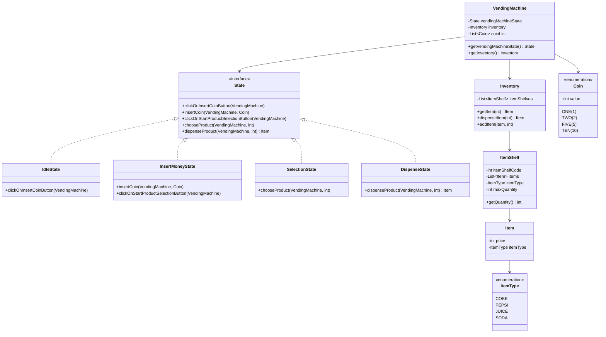

# VendingMachine

A Java implementation of a vending machine system using the State Design Pattern. This project demonstrates object-oriented programming principles, design patterns, and clean architecture.

## Features

- **State-based Operations**: Implements different states (Idle, Insert Money, Selection, Dispense)
- **Inventory Management**: Tracks items and quantities across multiple shelves
- **Coin Handling**: Supports multiple coin denominations (ONE, TWO, FIVE, TEN)
- **Product Selection**: Interactive product selection with code-based identification (codes 101-110)
- **Change Calculation**: Automatic change return functionality

## Architecture

The system uses the **State Design Pattern** with the following states:
- `IdleState`: Initial state, waiting for user interaction
- `InsertMoneyState`: Accepting coins from user
- `SelectionState`: Product selection phase
- `DispenseState`: Product dispensing and change return

## Class Diagram



## Available Products

- **COKE**: ₹12 (Codes 101-103)
- **PEPSI**: ₹9 (Codes 104-105)
- **JUICE**: ₹13 (Codes 106-107)
- **SODA**: ₹7 (Codes 108-110)

## Requirements

- Java 21
- Maven 3.6+

## Dependencies

- Lombok 1.18.30
- SLF4J 2.0.9
- Logback 1.4.11

## Usage

```bash
mvn compile exec:java -Dexec.mainClass="org.deepak.Main"
```

The application will:
1. Initialize inventory with 10 slots of products
2. Accept coin insertion (ONE, TWO, FIVE, TEN)
3. Allow product selection via console input (codes 101-110)
4. Dispense product and return change
5. Display inventory status before and after transaction